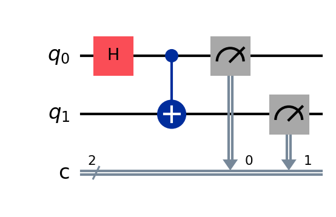

# QGPU Test Project

This project aims to explore and test the use of Quantum GPU (QGPU) with Python, leveraging Qiskit Aer for high-performance quantum circuit simulation. Qiskit Aer can utilize NVIDIA GPUs (CUDA >= 10.1) to accelerate simulations, especially for large quantum circuits. For best performance, install the appropriate GPU-enabled Aer package and ensure your system has the required CUDA drivers.

## Project Structure
- `qgpu_test.py`: Example script to test QGPU operations and visualize results using Qiskit Aer.
- `requirements.txt`: Required dependencies.

## Installation
1. Install the dependencies:
   ```bash
   pip install -r requirements.txt
   ```
2. (Optional, for GPU support) Install Qiskit Aer with GPU support:
   - For CUDA 12:
     ```bash
     pip install qiskit-aer-gpu
     ```
   - For CUDA 11:
     ```bash
     pip install qiskit-aer-gpu-cu11
     ```
   See the [Qiskit Aer documentation](https://qiskit.org/ecosystem/aer/) for more details.

## How to Use

## Quantum Circuit Example
Below is a visual representation of the Bell state quantum circuit used in this project:



## How to Use
Run the test script:
```bash
python qgpu_test.py
```
The script will build a quantum circuit, run a simulation, and display the results in multiple graph formats (histogram, pie chart, bar chart).

## Notes
- If you have a specific QGPU library, add it to `requirements.txt` and adapt the script according to the library documentation.
- For real GPU acceleration, ensure you have a compatible NVIDIA GPU and the correct CUDA version installed.
- Qiskit Aer supports advanced features like noise models, distributed simulation, and integration with NVIDIA cuQuantum SDK for further acceleration.

---

This project is a starting point for experiments with GPU-accelerated quantum computing in Python using Qiskit Aer.